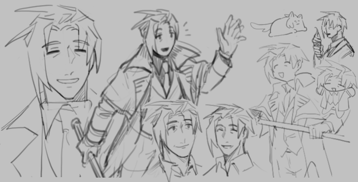

# 霧崎 柊

  

---

## 基本資料
- 年齡：46
- 身高：185cm
- 種族：人類
- 性別：男
- 職業：藝術協會警備隊長

## 外貌、特徵
- 外貌：深灰藍色的旁分髮型，右側瀏海較長，深黑色眼睛
神情和善、體格偏高大的中年男性
- 特徵：難以察覺的暗紅色瞳孔
- 常見穿著／配件：藏藍色襯衫與深色西裝褲，喜歡偏深藍色系的樸素裝扮

## 性格
- 和煦善良，有點天然

## 愛好、專長
- 喜歡讀工具書、親自學習新的技術
- 喜歡各種平民美食、地方特產
- 天生擅長如追跡、弱點分析、鬥毆等技能，但本人對於何時又如何學起這些沒有印象
- 喜歡白鴨子

## 排斥、不擅長
- 美術品，尤其是畫作
- 陳列美術畫作的美術館
- 恐怖作品，包括但不限於：恐怖電影、影集、漫畫與小說甚至鬼故事

## 備註
- 擁有水仙設定
- 沒有大約中學以前的記憶，對於此是異常地沒有任何想法與好奇

---

## 圖片

 

---

## 測試

|  | **霧崎 柊** 年齡：46 身高：185cm |
|---|---|
